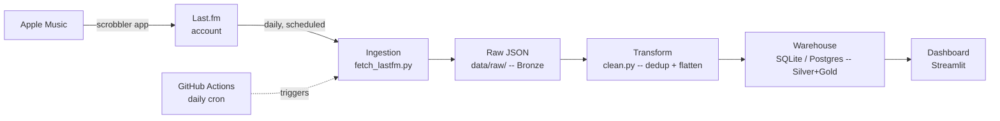

# Listening History Pipeline (Apple Music -> Last.fm -> Warehouse)

A scheduled ETL pipeline that ingests listening history from Apple Music
(bridged via Last.fm scrobbling) daily, loads it into a warehouse, and
surfaces listening trends and binge-day anomalies on a dashboard.

## Why this exists

Not "look, I called an API" -- the interesting part is the question it
answers: **how does my listening behavior shift over time, and when do I
binge?** Most public "music pipeline" projects are Spotify, because
Spotify has a well-documented OAuth flow; Apple Music doesn't expose
personal listening history to third-party developers at all. This
project routes around that using Last.fm as a bridge, builds a proper
dimensional model on top, and flags anomalies statistically instead of
eyeballing a chart.

## Architecture



**Bronze -> Silver -> Gold, mapped to this repo:**
| Layer | AWS-flavored version | What's actually in this repo |
|---|---|---|
| Ingestion | Lambda + EventBridge | `ingestion/fetch_lastfm.py` + GitHub Actions cron |
| Bronze (raw) | S3 | `data/raw/*.json` |
| Transform | Glue (Spark) | `transform/clean.py` (pandas) |
| Silver/Gold (warehouse) | Snowflake | SQLite by default, Postgres-compatible (`sql/schema.sql`) |
| Serving | Power BI | Streamlit (`dashboard/app.py`) |

## Two real constraints this project had to design around

**1. Apple Music has no personal-listening-history API for third parties.**
The workaround is Last.fm: a free scrobbler app (see setup below) pushes
your Apple Music plays to a Last.fm account in real time, and this
pipeline reads from Last.fm's public API -- which needs only a free API
key, no OAuth, no subscription requirement on either end (Spotify started
requiring the app-registering account to have Premium in Feb 2026; this
sidesteps that entirely).

**2. Last.fm doesn't reliably provide a stable ID for every track/artist.**
`mbid` (MusicBrainz ID) is frequently blank -- lots of scrobbles never
get matched to MusicBrainz's catalog. `transform/clean.py` derives a key
by hashing the normalized (lowercased, trimmed) name instead. That's an
imperfect fix -- "Beatles" and "The Beatles" would get different keys --
but it's the standard workaround for source data without guaranteed IDs,
documented in code rather than silently swept under the rug.

**One honest limitation:** there's no bulk import of past Apple Music
history into Last.fm -- your real data starts accumulating from the
moment you set up the scrobbler, not before. The mock data generator
exists so you can build and demo the full pipeline immediately while
real history layers in day by day underneath.

## Setup

### 1. Get a free Last.fm API key
Go to https://www.last.fm/api/account/create, sign up (free), and copy
the API key. No app review, no payment, ever.

### 2. Bridge Apple Music to Last.fm
Pick whichever matches your device:
- **iPhone**: "Finale for Last.fm" (free, open source) -- scrobbles
  automatically in the background.
- **Mac**: "ScrobbleMate" or "Scrobbles for Last.fm" -- similar automatic
  background scrobbling.
- Last.fm's own app also has a "scan & submit" feature for Apple Music's
  library, if you'd rather do it manually.

Do this today -- the sooner scrobbling starts, the more real history
you'll have by the time you want to demo this.

### 3. Local environment
```bash
python -m venv venv
source venv/bin/activate        # Windows: venv\Scripts\activate
pip install -r requirements.txt
cp .env.example .env            # fill in LASTFM_API_KEY and LASTFM_USERNAME
```

### 4. Try it with mock data first (no waiting on real scrobbles)
```bash
python run_pipeline.py --mock
streamlit run dashboard/app.py
```

### 5. Switch to real data (once you've been scrobbling a few days)
```bash
python run_pipeline.py --live
streamlit run dashboard/app.py
```

### 6. Automate it (optional, for the "real pipeline" story)
Push to GitHub, add these as repo secrets (`Settings -> Secrets -> Actions`):
`LASTFM_API_KEY`, `LASTFM_USERNAME`, `DATABASE_URL`. The workflow in
`.github/workflows/daily_ingest.yml` runs the pull once a day.

## Project structure
```
ingestion/    fetch_lastfm.py (real), generate_mock_data.py (dev/testing)
transform/    clean.py -- flatten + dedupe raw JSON into DataFrames
load/         load_to_db.py -- idempotent load into the warehouse
sql/          schema.sql (reference DDL), analysis_queries.sql
dashboard/    app.py -- Streamlit dashboard
data/raw/     Bronze layer (gitignored)
data/processed/  SQLite warehouse file (gitignored)
```

## What's genuinely engineered here (not just "connected an API")
- **Idempotent loads**: re-running ingestion never duplicates rows.
  Plays are deduped on `(track_id, played_at)`, snapshots on
  `(item_type, item_key, time_range, pulled_at)`.
- **Portable across SQLite and Postgres**: same load code, no
  engine-specific `ON CONFLICT` syntax -- swap `DATABASE_URL` and it works.
- **Statistical anomaly detection, not a hardcoded threshold**: binge days
  are flagged via z-score against your own listening baseline, so it
  adapts per person instead of assuming "20 plays = a lot."
- **Entity resolution without a reliable source ID**: derives keys from
  normalized names since `mbid` can't be trusted, and says so.
- **Bridges a data source with no public API** (Apple Music) via a
  documented workaround, rather than picking the path of least
  resistance (Spotify) that everyone else's portfolio project already uses.
